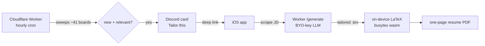

# JobPilot

New-grad job openings, tailored resume, one tap. A personal pipeline that watches company career boards, pings me on Discord the moment a relevant role goes live, and turns that posting into a resume PDF tailored to it, rendered on-device.

It's single-tenant by design (built for me), but everything is bring-your-own: your Cloudflare account, your LLM key, your watchlist.

## How it works



1. **Watch.** A Worker cron sweeps company boards every hour (Greenhouse, Lever, Ashby, Amazon, eightfold) plus a browser-rendered tier for boards with no JSON API (Google, Apple, Meta). Postings are filtered down to US new-grad software roles.
2. **Notify.** Genuinely-new matches post to Discord as cards with a deep link.
3. **Tailor.** Tapping the card opens the iOS app, which scrapes the job description and sends it to the Worker's `/generate`. An LLM rewrites the master resume against the posting, guarded against invented numbers.
4. **Render.** The app compiles the returned LaTeX into a PDF **on the phone** with a WASM TeX engine, then trims it to exactly one page and hands over a share sheet.

## What makes it interesting

- **On-device LaTeX.** [busytex](https://github.com/busytex/busytex) (a WASM TeX distribution) runs in an offscreen `WKWebView`, so resumes render offline with no server. The bundle is trimmed to 38MB and its output is pixel-identical to desktop `pdflatex`.
- **Deterministic one-page fit.** The model can't see rendered page count, so drafts land at ~1.2 pages. The app compiles, and while it's over a page it drops the least-relevant trailing bullet and recompiles warm. No LLM in the trim loop.
- **Invented-number guard.** Every number in the tailored resume is checked against the master. A fabricated stat triggers a corrective pass naming it, then re-validates.
- **Filter that reads the fine print.** A role titled "Software Engineer" that quietly demands 5+ years in its qualifications gets dropped. The filter reads the description, not just the title, and never drops a genuine new-grad posting.
- **Free-tier aware.** Memory-safe sweeps that retain only unseen jobs, per-company cold-start seeding so adding a company doesn't blast its whole backlog, and overnight quiet hours.

## Stack

| Piece | Tech |
|-------|------|
| Job watcher | Cloudflare Workers (TypeScript, no deps), KV, Cron Triggers, Browser Rendering |
| Notifications | Discord bot (HTTP interactions, link buttons) |
| Resume tailoring | BYO-key LLM via an OpenAI-shaped adapter (Gemini free tier by default) |
| App | SwiftUI + SwiftData, deep-link routing |
| PDF | busytex WASM TeX in an offscreen WebView |

## Layout

```
worker/          Cloudflare Worker: watcher + /generate
  src/adapters/  one file per ATS (greenhouse, lever, ashby, amazon, eightfold, workday)
  src/sweep.ts   pure diff of live jobs vs seen set
  src/filter.ts  US new-grad software filter (incl. years-of-experience gate)
  src/tier3.ts   browser-rendered boards, round-robin
  src/generate.ts LLM drafter + corrective pass
ios/             SwiftUI app
  JobPilot/LatexEngine.swift  on-device LaTeX
  JobPilot/busytex/           vendored WASM TeX engine + trimmed texmf
```

## Running it yourself

The Worker needs a Cloudflare account, a KV namespace, a Discord bot token, and an LLM key, all set as `wrangler secret`s. The watchlist lives in `worker/src/registry.ts`. The app points at your Worker URL. It's a personal build, so expect to wire your own credentials rather than a one-command setup.

## Status

Watcher and tailor pipeline are live. The apply half (per-ATS form autofill) is next.
